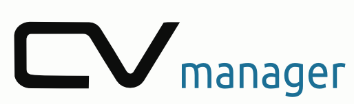
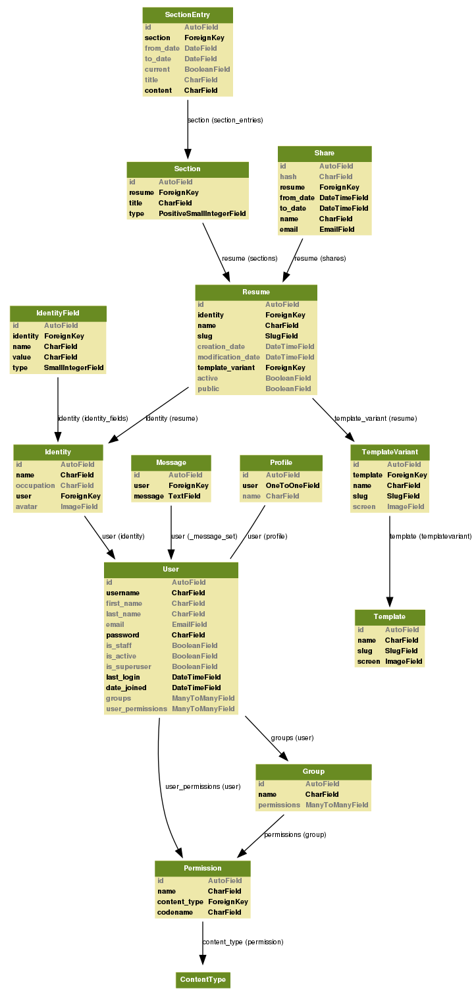

.. cv manager documentation master file, created by
   sphinx-quickstart on Fri Dec 16 01:02:24 2011.
   You can adapt this file completely to your liking, but it should at least
   contain the root `toctree` directive.

cv manager documentation
''''''''''''''''''''''''

.. contents::

Introduction
============

What is CVM?
------------

It's a web application, that allows it's users to easily manage, share and publish their resumes.
It allows the user to create multiple identities for the purpose of managing resumes of multiple people, like family or friends. Each identity is able to contain multiple resumes of a person, so that each resume can be created for a specific job application. The user is able to choose a layout for the resume from templates designed by professional graphic artists.

Publication and Sharing
-----------------------

The user is able to generate PDF files for printing or electronic use. The user is also able to publish a resume on the portal or to send a link, allowing the manager to view a resume for a limited period of time.

How CVM works?
--------------

 1. User registers
 2. User creates new Resume
 3. User fills in Resume
    a. User creates or chooses already created Identity
    b. User uploads or chooses already uploaded Photo
    c. Users fills in Sections and Entries
 4. User Shares or Publish Resume
 5. User edits or creates new Resumes

Structure
=========

Models schema
-------------

Resumes app
-----------

Main app containing and controlling most important features.

Models
~~~~~~

.. automodule:: resumes.models
   :members:
   

Views
~~~~~

.. automodule:: resumes.views
   :members:
   

Managers
~~~~~~~~

.. automodule:: resumes.managers
   :members:
   

Templatetags
~~~~~~~~~~~~

resume_tags
...........

.. automodule:: resumes.templatetags.resume_tags
   :members:

image
.....

.. automodule:: resumes.templatetags.image
   :members:
   

current_site
............

.. automodule:: resumes.templatetags.current_site
   :members:
   

Sharing app
-----------

App containing models for sharing feature.

.. automodule:: sharing.models
   :members:
   
Accounts app
------------

Nothing's really there yet. Can be used to extend user's profile. Made as separate app to maintain consistency with Django's buildins and coding style.

.. automodule:: accounts.models
   :members:
   
Portal app
----------

Views ad forms for user's panel are here.

Views
~~~~~

.. automodule:: panel.views
   :members:

Forms
~~~~~

.. automodule:: panel.forms
   :members:

Templatetags (panel_tags)
~~~~~~~~~~~~~~~~~~~~~~~~~

.. automodule:: panel.templatetags.panel_tags
   :members:

Source
======

All sources for this project are available online at `bitbucket.org/seler/cvm <https://bitbucket.org/seler/cvm/>`_.

To clone this repository run::

    hg clone https://bitbucket.org/seler/cvm

Django
------

cv managers is built using `Django framework<http://djangoproject.com>`_.

The core Django MVC framework consists of an object-relational mapper which mediates between data models (defined as Python classes) and a relational database ("*M*odel"); a system for processing requests with a web templating system ("*V*iew") and a regular-expression-based URL dispatcher ("*C*ontroller").

For more information visit `djangoproject.com<http://djangoproject.com>`_

Requirements
------------

* Django

    Version 1.3 or higher.

* PIL

    Tested using version 1.1.7

* django-registration

    Version 0.7. Newer version wont work because of backwards imcompatible changes

* xhtml2pdf
  
   Make sure you checkout latest source from https://github.com/chrisglass/xhtml2pdf

Initial data
------------

cv manager comes with sample data which is automatically inserted into database.

login with followin credentials:

:login: admin
:password: admin

and

:login: lenna
:password: lenna
